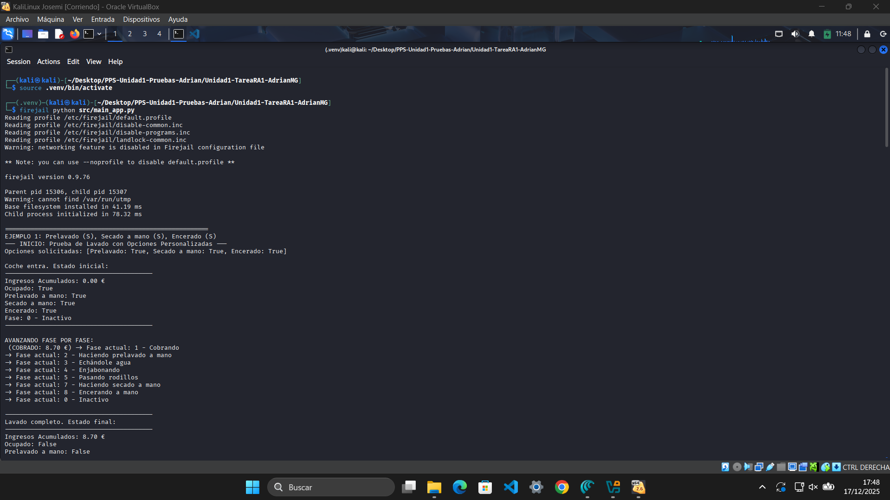

# Ejecución en Sandbox

---

Para validar el comportamiento del programa en un entorno controlado, se ha realizado la ejecución dentro de una **Sandbox** (máquina virtual aislada con Kali Linux).  
Esto permite simular el uso real del sistema sin afectar el entorno principal y garantiza que el código funciona correctamente en condiciones reproducibles.

### 🔧 Proceso realizado
1. Se accede a la máquina virtual.
2. Se abre una terminal y se navega al directorio del proyecto.
3. Activamos el entorno con el siguiente comando:

```bash
source .venv/bin/activate
```
4. Se ejecuta el archivo `main_app.py` con el siguiente comando:

```bash
firejail python src/main_app.py
```

5. El programa simula distintos escenarios de lavado, mostrando por consola:
   - Opciones seleccionadas.
   - Transición por fases.
   - Estado final del lavadero.
   - Ingresos acumulados.

### 📸 Capturas del proceso
- Terminal dentro de la Sandbox mostrando la ejecución del script.

  

---

Esta ejecución confirma que el sistema funciona correctamente en un entorno aislado, y que los resultados obtenidos coinciden con los esperados según los requisitos funcionales.
