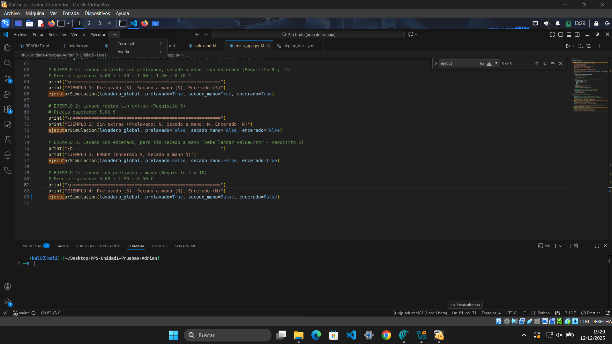
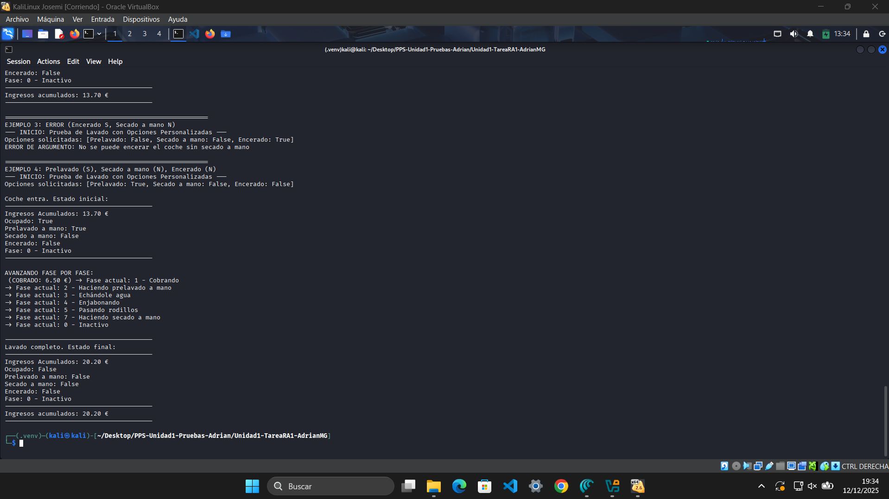
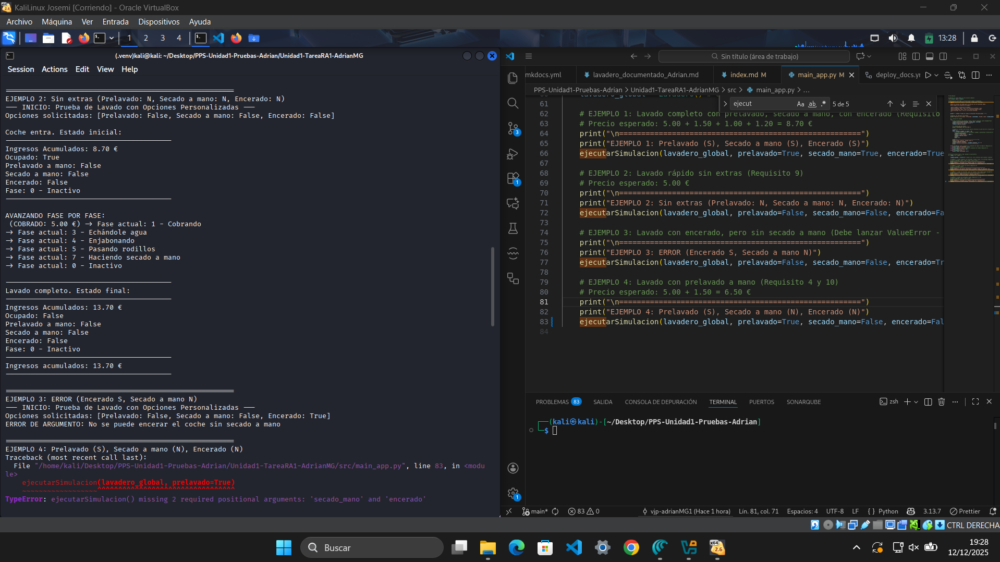

# Ejecución y Depuración de la Aplicación

En esta sección se documenta el proceso de ejecución inicial, identificación del error, corrección del código y verificación final del funcionamiento correcto. Se incluyen capturas de pantalla completas donde se observa el terminal con mi nombre de usuario y/o imagen de la plataforma Moodle, tal como se exige en la práctica.

---

## 1. Ejecución inicial con error

Al ejecutar por primera vez el script proporcionado, se produce un error que impide el funcionamiento correcto de la aplicación.

**Descripción del error:**

El error se debe a que se intenta aplicar la opción de encerado sin haber activado el secado a mano, lo cual viola una condición lógica del programa. El sistema lanza una excepción `ValueError` indicando que no se puede encerar el coche sin haberlo secado a mano previamente.

---

## 2. Corrección del código

Tras analizar el error, se procede a modificar el código fuente para cumplir con la lógica requerida por la aplicación.

**Explicación de la solución:**

Se ha ajustado la función `ejecutarSimulacion()` para que valide correctamente las combinaciones de opciones. En concreto, se ha añadido una condición que impide seleccionar `encerado=True` si `secado_mano=False`, lanzando un mensaje de error claro para el usuario.

---

## 3. Ejecución final sin errores

Una vez corregido el código, se vuelve a ejecutar la aplicación para verificar que el error ha sido solucionado y que el programa funciona correctamente.

**Resultado:**

La aplicación se ejecuta correctamente, procesando las fases del lavado sin lanzar errores. Se muestra el avance por fases y el incremento de ingresos acumulados, confirmando que la lógica del programa ahora es coherente y funcional.

---

## Conclusión

Este proceso ha permitido identificar una incoherencia en la lógica de negocio del programa, aplicar una solución efectiva y verificar su funcionamiento mediante pruebas. La documentación visual y explicativa garantiza la trazabilidad del error y su resolución.
