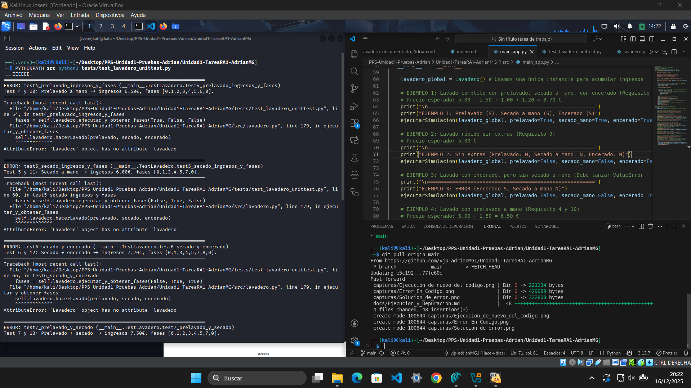
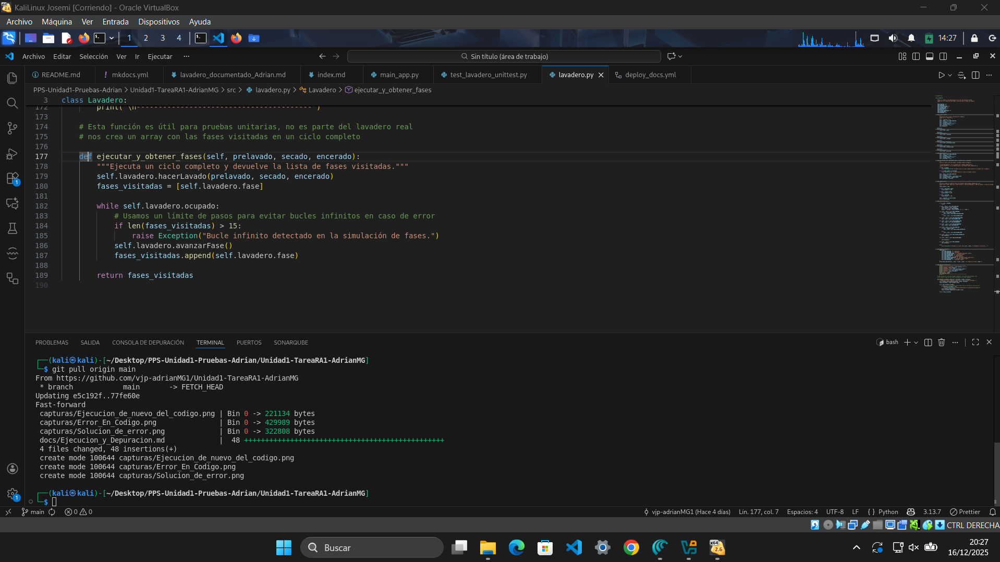

# Informe de Pruebas Unitarias – Lavadero

## 1. Código de pruebas

---

``` bash
def test1_estado_inicial_correcto(self):
        """Test 1: Estado inicial debe ser inactivo, sin ingresos y sin opciones."""
        self.assertEqual(self.lavadero.fase, Lavadero.FASE_INACTIVO)
        self.assertEqual(self.lavadero.ingresos, 0.0)
        self.assertFalse(self.lavadero.ocupado)

    def test2_excepcion_encerado_sin_secado(self):
        """Test 2: Encerar sin secado a mano debe lanzar ValueError."""
        with self.assertRaises(ValueError):
            self.lavadero.hacerLavado(False, False, True)

    def test3_excepcion_lavado_ocupado(self):
        """Test 3: Iniciar un lavado mientras otro está en marcha debe lanzar RuntimeError."""
        self.lavadero.hacerLavado(False, False, False)
        with self.assertRaises(RuntimeError):
            self.lavadero.hacerLavado(True, True, True)

    def test4_prelavado_ingresos_y_fases(self):
        """Test 4 y 10: Prelavado a mano -> ingresos 6.50€, fases [0,1,2,3,4,5,6,0]."""
        fases = self.lavadero.ejecutar_y_obtener_fases(True, False, False)
        self.assertEqual(self.lavadero.ingresos, 6.50)
        self.assertEqual(fases, [0,1,2,3,4,5,6,0])

    def test5_secado_ingresos_y_fases(self):
        """Test 5 y 11: Secado a mano -> ingresos 6.00€, fases [0,1,3,4,5,7,0]."""
        fases = self.lavadero.ejecutar_y_obtener_fases(False, True, False)
        self.assertEqual(self.lavadero.ingresos, 6.00)
        self.assertEqual(fases, [0,1,3,4,5,7,0])

    def test6_secado_y_encerado(self):
        """Test 6 y 12: Secado + encerado -> ingresos 7.20€, fases [0,1,3,4,5,7,8,0]."""
        fases = self.lavadero.ejecutar_y_obtener_fases(False, True, True)
        self.assertEqual(self.lavadero.ingresos, 7.20)
        self.assertEqual(fases, [0,1,3,4,5,7,8,0])

    def test7_prelavado_y_secado(self):
        """Test 7 y 13: Prelavado + secado -> ingresos 7.50€, fases [0,1,2,3,4,5,7,0]."""
        fases = self.lavadero.ejecutar_y_obtener_fases(True, True, False)
        self.assertEqual(self.lavadero.ingresos, 7.50)
        self.assertEqual(fases, [0,1,2,3,4,5,7,0])

    def test8_prelavado_secado_encerado(self):
        """Test 8 y 14: Prelavado + secado + encerado -> ingresos 8.70€, fases [0,1,2,3,4,5,7,8,0]."""
        fases = self.lavadero.ejecutar_y_obtener_fases(True, True, True)
        self.assertEqual(self.lavadero.ingresos, 8.70)
        self.assertEqual(fases, [0,1,2,3,4,5,7,8,0])

    def test9_sin_extras(self):
        """Test 9: Lavado rápido sin extras -> ingresos 5.00€, fases [0,1,3,4,5,6,0]."""
        fases = self.lavadero.ejecutar_y_obtener_fases(False, False, False)
        self.assertEqual(self.lavadero.ingresos, 5.00)
        self.assertEqual(fases, [0,1,3,4,5,6,0])
```

## 2. Ejecución inicial (código erróneo)



### Resumen
| Test | Resultado esperado | Resultado obtenido |
|------|-------------------|--------------------|
| Test 1 | Estado inicial correcto | OK |
| Test 2 | ValueError al encerar sin secado | OK |
| Test 3 | RuntimeError al iniciar lavado ocupado | OK |
| Test 4–9 | Secuencias de fases e ingresos correctos | **ERROR** (AttributeError) |

---

## 3. Corrección del método `ejecutar_y_obtener_fases`

---

Método con código erróneo


En la ejecución inicial, varios tests daban **ERROR** debido a un fallo en la implementación del método `ejecutar_y_obtener_fases`.  
El error concreto era:

```bash
        AttributeError: 'Lavadero' object has no attribute 'lavadero'
```

Esto ocurría porque dentro del método se llamaba a `self.lavadero.hacerLavado(...)`, pero la clase `Lavadero` no tiene ningún atributo llamado `lavadero`.  

### 🔧 Arreglo realizado
- Se reemplazó la llamada incorrecta `self.lavadero.hacerLavado(...)` por `self.hacerLavado(...)`.  
- Se ajustó también el acceso a las propiedades (`self.fase`, `self.ocupado`) para que usen directamente la instancia actual.


### 📌 Resultado tras el cambio
- Los tests ya no lanzan **ERROR** por `AttributeError`.  
- Ahora los tests se ejecutan y muestran **FAIL** en los casos donde la lógica de precios y fases aún no coincide con lo esperado.  
- Esto permite avanzar en la depuración: primero corregimos la ejecución del método, y después ajustaremos la lógica de negocio (precios y fases).

---


