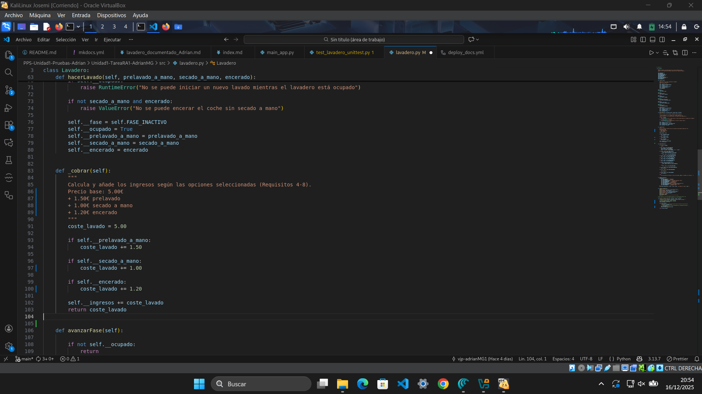
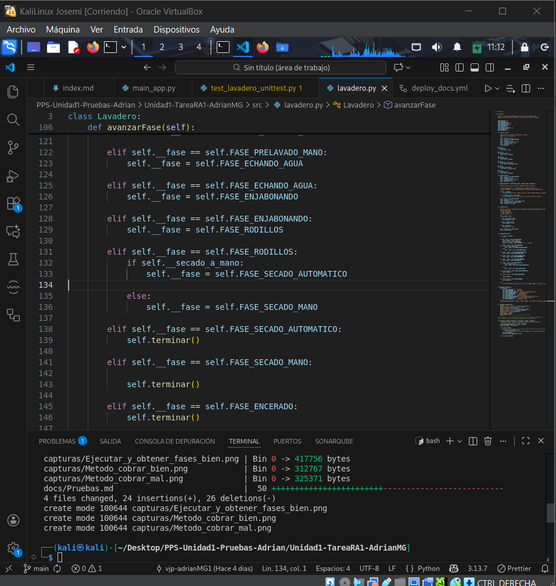
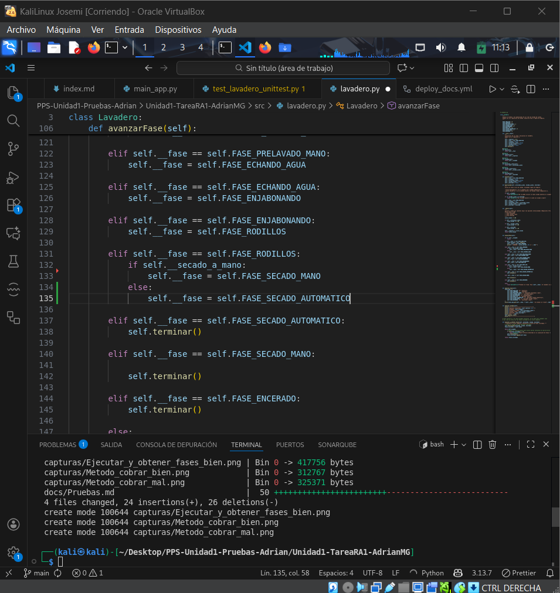
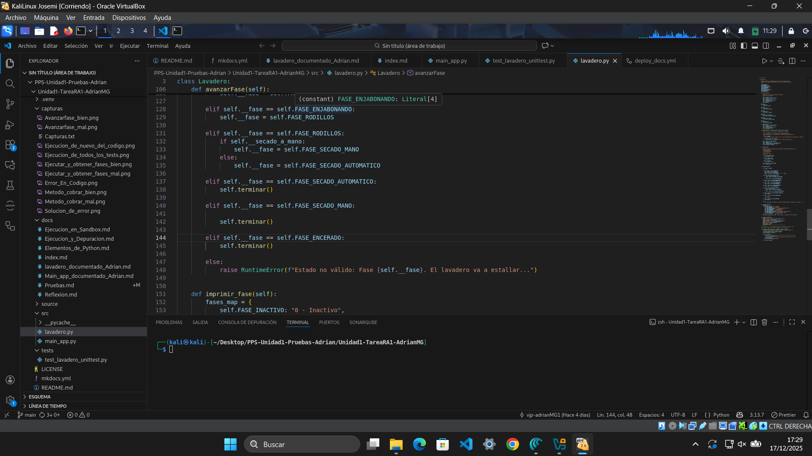
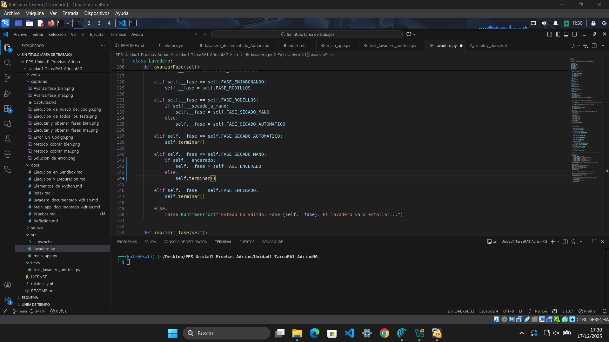

# Informe de Pruebas Unitarias – Lavadero

## 1. Código de pruebas

---

``` bash
def test1_estado_inicial_correcto(self):
        """Test 1: Estado inicial debe ser inactivo, sin ingresos y sin opciones."""
        self.assertEqual(self.lavadero.fase, Lavadero.FASE_INACTIVO)
        self.assertEqual(self.lavadero.ingresos, 0.0)
        self.assertFalse(self.lavadero.ocupado)

    def test2_excepcion_encerado_sin_secado(self):
        """Test 2: Encerar sin secado a mano debe lanzar ValueError."""
        with self.assertRaises(ValueError):
            self.lavadero.hacerLavado(False, False, True)

    def test3_excepcion_lavado_ocupado(self):
        """Test 3: Iniciar un lavado mientras otro está en marcha debe lanzar RuntimeError."""
        self.lavadero.hacerLavado(False, False, False)
        with self.assertRaises(RuntimeError):
            self.lavadero.hacerLavado(True, True, True)

    def test4_prelavado_ingresos_y_fases(self):
        """Test 4 y 10: Prelavado a mano -> ingresos 6.50€, fases [0,1,2,3,4,5,6,0]."""
        fases = self.lavadero.ejecutar_y_obtener_fases(True, False, False)
        self.assertEqual(self.lavadero.ingresos, 6.50)
        self.assertEqual(fases, [0,1,2,3,4,5,6,0])

    def test5_secado_ingresos_y_fases(self):
        """Test 5 y 11: Secado a mano -> ingresos 6.00€, fases [0,1,3,4,5,7,0]."""
        fases = self.lavadero.ejecutar_y_obtener_fases(False, True, False)
        self.assertEqual(self.lavadero.ingresos, 6.00)
        self.assertEqual(fases, [0,1,3,4,5,7,0])

    def test6_secado_y_encerado(self):
        """Test 6 y 12: Secado + encerado -> ingresos 7.20€, fases [0,1,3,4,5,7,8,0]."""
        fases = self.lavadero.ejecutar_y_obtener_fases(False, True, True)
        self.assertEqual(self.lavadero.ingresos, 7.20)
        self.assertEqual(fases, [0,1,3,4,5,7,8,0])

    def test7_prelavado_y_secado(self):
        """Test 7 y 13: Prelavado + secado -> ingresos 7.50€, fases [0,1,2,3,4,5,7,0]."""
        fases = self.lavadero.ejecutar_y_obtener_fases(True, True, False)
        self.assertEqual(self.lavadero.ingresos, 7.50)
        self.assertEqual(fases, [0,1,2,3,4,5,7,0])

    def test8_prelavado_secado_encerado(self):
        """Test 8 y 14: Prelavado + secado + encerado -> ingresos 8.70€, fases [0,1,2,3,4,5,7,8,0]."""
        fases = self.lavadero.ejecutar_y_obtener_fases(True, True, True)
        self.assertEqual(self.lavadero.ingresos, 8.70)
        self.assertEqual(fases, [0,1,2,3,4,5,7,8,0])

    def test9_sin_extras(self):
        """Test 9: Lavado rápido sin extras -> ingresos 5.00€, fases [0,1,3,4,5,6,0]."""
        fases = self.lavadero.ejecutar_y_obtener_fases(False, False, False)
        self.assertEqual(self.lavadero.ingresos, 5.00)
        self.assertEqual(fases, [0,1,3,4,5,6,0])
```

## 2. Ejecución inicial (código erróneo)


### Resumen
| Test | Resultado esperado | Resultado obtenido |
|------|-------------------|--------------------|
| Test 1 | Estado inicial correcto | OK |
| Test 2 | ValueError al encerar sin secado | OK |
| Test 3 | RuntimeError al iniciar lavado ocupado | OK |
| Test 4–9 | Secuencias de fases e ingresos correctos | **ERROR** (AttributeError) |

---

## 3. Corrección del método `ejecutar_y_obtener_fases`

---

Método con código erróneo


En la ejecución inicial, varios tests daban **ERROR** debido a un fallo en la implementación del método `ejecutar_y_obtener_fases`.  
El error concreto era:

```bash
        AttributeError: 'Lavadero' object has no attribute 'lavadero'
```

Esto ocurría porque dentro del método se llamaba a `self.lavadero.hacerLavado(...)`, pero la clase `Lavadero` no tiene ningún atributo llamado `lavadero`.  

### 🔧 Arreglo realizado
- Se reemplazó la llamada incorrecta `self.lavadero.hacerLavado(...)` por `self.hacerLavado(...)`.  
- Se ajustó también el acceso a las propiedades (`self.fase`, `self.ocupado`) para que usen directamente la instancia actual.


### 📌 Resultado tras el cambio
- Los tests ya no lanzan **ERROR** por `AttributeError`.  
- Ahora los tests se ejecutan y muestran **FAIL** en los casos donde la lógica de precios y fases aún no coincide con lo esperado.  
- Esto permite avanzar en la depuración: primero corregimos la ejecución del método, y después ajustaremos la lógica de negocio (precios y fases).

---


## 4. Corrección del método `_cobrar`

---

Bloque de código erróneo  


En la ejecución tras corregir `ejecutar_y_obtener_fases`, varios tests pasaron de **ERROR** a **FAIL**.  
El fallo concreto estaba en los **ingresos calculados**:  

- El test de secado a mano (`test5_secado_ingresos_y_fases`) esperaba **6.00 €**, pero el resultado era **6.20 €**.  
- El test de secado + encerado (`test6_secado_y_encerado`) esperaba **7.20 €**, pero el resultado era **7.00 €**.  
- Otros tests también mostraban diferencias en los ingresos acumulados.

Esto ocurría porque en el método `_cobrar` los valores de los extras estaban mal asignados:  
- **Secado a mano** sumaba 1.20 € en lugar de 1.00 €.  
- **Encerado** sumaba 1.00 € en lugar de 1.20 €.

### 🔧 Arreglo realizado
- Se corrigió el valor del **secado a mano**: ahora suma 1.00 €.  
- Se corrigió el valor del **encerado**: ahora suma 1.20 €.  
- Se mantuvo el precio base de 5.00 € y el prelavado a mano en 1.50 €.



### 📌 Resultado tras el cambio
- Los tests de ingresos (`test5`, `test6`, `test7`, `test8`, `test9`) ahora muestran los valores correctos.  
- Los FAIL por diferencias de precio desaparecen.  
- Los tests aún muestran **FAIL** en algunos casos de fases, lo que indica que el siguiente paso es corregir la lógica de transición en `avanzarFase`.

## 5. Corrección de la transición en la fase de rodillos

---

Bloque de código erróneo  


Tras corregir los ingresos en `_cobrar`, varios tests seguían dando **FAIL**.  
El fallo concreto estaba en las **secuencias de fases**:  

- El test de secado a mano (`test5_secado_ingresos_y_fases`) esperaba terminar en la fase **7 (Secado a mano)**, pero el flujo terminaba en la fase **6 (Secado automático)**.  
- El test de lavado sin extras (`test9_sin_extras`) esperaba terminar en la fase **6 (Secado automático)**, pero el flujo terminaba en la fase **7 (Secado a mano)**.  

Esto ocurría porque la condición en el bloque de rodillos estaba **invertida**:  
- Si `secado_a_mano = True`, el código enviaba a fase 6 (automático).  
- Si `secado_a_mano = False`, el código enviaba a fase 7 (manual).  

### 🔧 Arreglo realizado
- Se corrigió la condición en el bloque `elif self.__fase == self.FASE_RODILLOS`:  
  - Si **secado_a_mano = True** → pasar a **FASE_SECADO_MANO (7)**.  
  - Si **secado_a_mano = False** → pasar a **FASE_SECADO_AUTOMATICO (6)**.  



### 📌 Resultado tras el cambio
- El test de secado a mano (`test5`) ahora muestra la secuencia correcta: `[0,1,3,4,5,7,0]`.  
- El test sin extras (`test9`) ahora muestra la secuencia correcta: `[0,1,3,4,5,6,0]`.  
- Los FAIL por rutas incorrectas desaparecen.  
- Los tests con encerado aún fallan, lo que indica que el siguiente paso es corregir la transición desde la fase 7 hacia la fase 8 cuando se selecciona encerado.

## 6. Corrección de la transición desde la fase 7 (Secado a mano) hacia la fase 8 (Encerado)

---

Bloque de código erróneo  


Tras corregir la transición en la fase de rodillos, varios tests seguían dando **FAIL**.  
El fallo concreto estaba en los **lavados que incluían encerado junto al secado a mano**:  

- El test de secado + encerado (`test6_secado_y_encerado`) esperaba la secuencia `[0,1,3,4,5,7,8,0]`, pero el flujo terminaba en `[0,1,3,4,5,7,0]`.  
- El test de prelavado + secado + encerado (`test8_prelavado_secado_encerado`) esperaba `[0,1,2,3,4,5,7,8,0]`, pero el flujo terminaba en `[0,1,2,3,4,5,7,0]`.  

Esto ocurría porque el bloque de transición en la fase 7 llamaba directamente a `terminar()`, sin comprobar si había que pasar por la fase 8 (encerado).

### 🔧 Arreglo realizado
- Se modificó el bloque `elif self.__fase == self.FASE_SECADO_MANO`:  
  - Si **encerado = True** → pasar a **FASE_ENCERADO (8)**.  
  - Si **encerado = False** → llamar a `terminar()`.  



### 📌 Resultado tras el cambio
- El test de secado + encerado (`test6`) ahora muestra la secuencia correcta: `[0,1,3,4,5,7,8,0]`.  
- El test de prelavado + secado + encerado (`test8`) ahora muestra la secuencia correcta: `[0,1,2,3,4,5,7,8,0]`.  
- Los FAIL por rutas incompletas desaparecen.  
- Con esta corrección, todos los tests de ingresos y fases pasan a **OK**.
